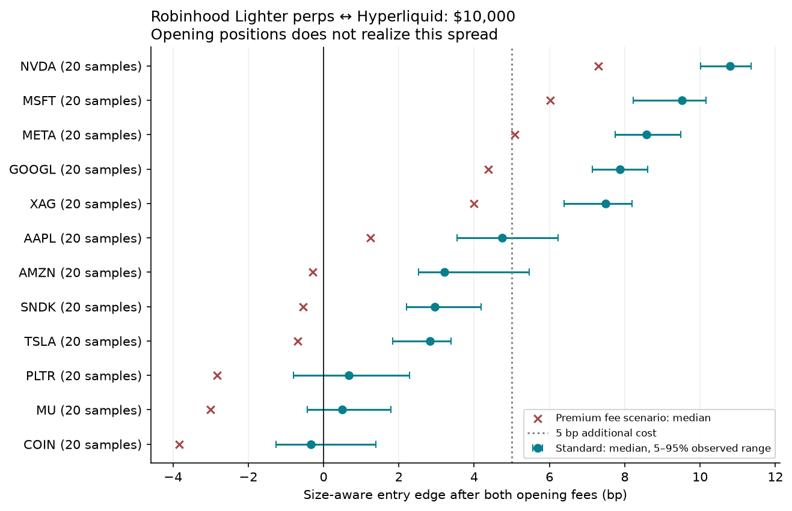
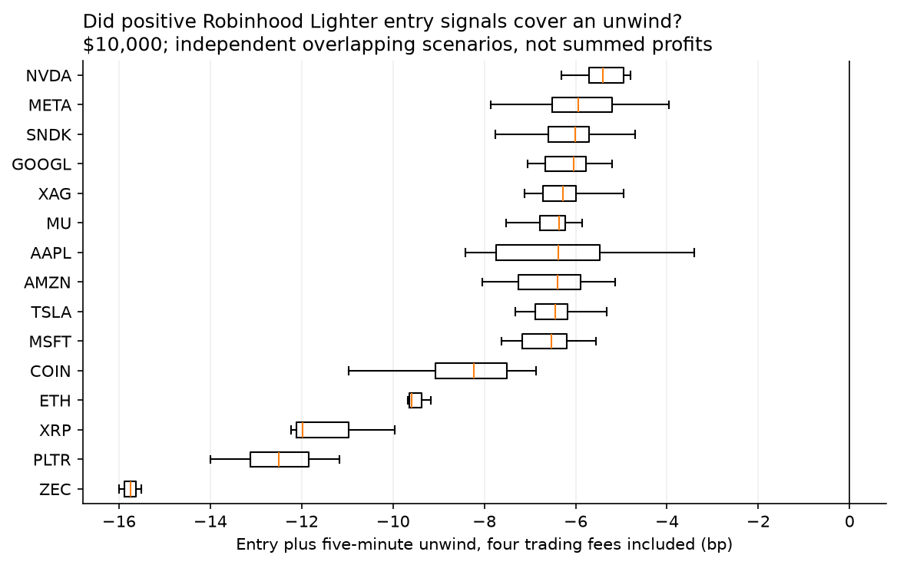
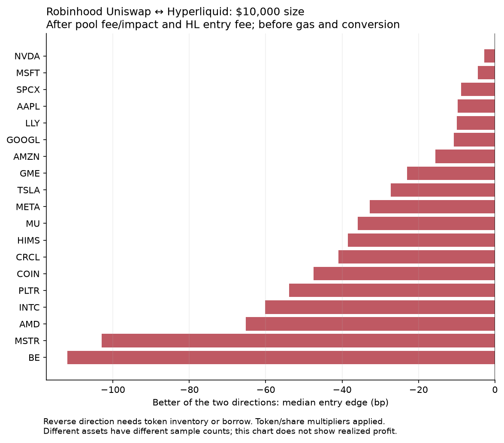
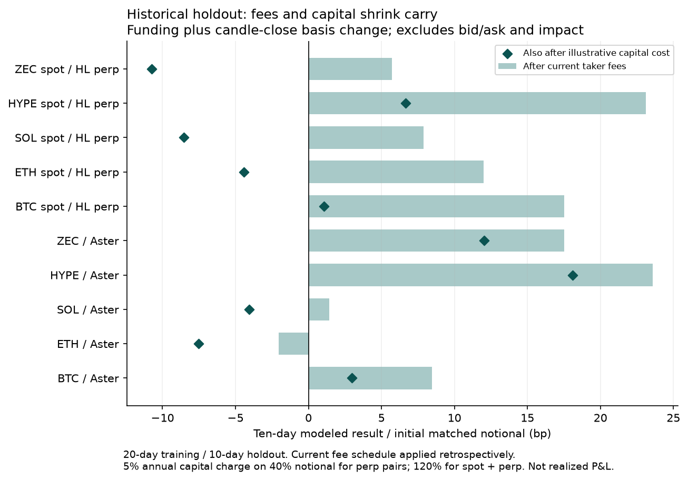

# Robinhood Chain × Hyperliquid arbitrage survey

Generated 2026-09-29T04:32:43.097107+00:00. Research only; public data and read-only swap simulations. **No trades were placed.**

**Fee correction (September 29 follow-up):** Aster has separate RWA and Group B schedules. The Aster results below retain the original flat 4 bp scenario; see the [overnight audit](monitor-audit/REPORT.md) for corrected fees and signal/exit analysis.

## Subsequent short-horizon paper research

The original survey below describes opening quotes and historical carry, not
completed short-horizon trades. Later execution simulation does **not** validate
a profitable ten-second strategy: the 18:26 UTC review recorded 185 baseline
closes totaling -$201.31, with zero winning paired closes. A separate fixed
chronological holdout lost $624.27; removing both explicit trading fees and the
modeled extra-cost reserve still left a $228.90 loss on the same fills.

See the [review journal](../research/review-loop.md),
[fee sensitivity](fee-sensitivity/REPORT.md), and
[active research operations](../research/live-operations.md) for subsequent
experiments and their limits. Opening-edge rankings below must not be read as
realized profit rankings.

Further completed studies through **20:29 UTC** agree on that limitation:

| Experiment | Observation | Interpretation |
|---|---|---|
| [Original-size prospective quotes](fixed-markout-v1/final.md) | 1,595 complete outcomes across 12 assets; one positive after four fees, none after reserve | Even optimistic entry timing did not establish a profitable selected rule; 539 other outcomes were censored |
| [Forward closing-basis forecast](horizon-v2/report.md) | Conditional model MAE 0.927 bp versus persistence 1.094 bp on 2,797 shared observations | Better prediction accuracy did not yield positive economic selections |
| [Prospective maker paths](../research/maker-roundtrip-prospective.md) | Primary scenario: 32 full public-trade-flow cases, 23 hedge quotes, 14 complete exits; all 14 negative after fees | Queue flow is not a fill; nine missing hedge and nine missing exit outcomes remain unresolved |
| [Scheduled review at 20:26 UTC](../research/review-loop.md) | Baseline 102 closes, −$150.45; cooldown 53, −$85.91; median gate three, −$7.48 | No winning closes; no replacement policy promoted |
| [Impulse confirmation](impulse-v1/README.md) | 117,863 valid pair evaluations; one arm failed confirmation; zero entries | No economic or latency outcome to estimate |
| [NVDA/silver maker quotes](maker-equity-v2/results.md) | One hypothetical full-flow case and hedge; no eligible complete exit | Missing exit is unresolved, not zero P&L |

These studies share market periods and are not independent estimates to combine
into a portfolio return. All economic experiments use public quotes; maker flow
conditions do not establish queue position or actual fills.

## Strategy research priority, 20:58 UTC follow-up

The user clarified the hypothesis: small orders may find an edge on the newer
Robinhood venue. The [primary-source strategy review](../research/sota-strategy-review.md)
now prioritizes RH maker quotes priced against a Hyperliquid hedge and an
explicit final unwind, with inventory, adverse selection, and account-tier
controls. It distinguishes these mechanisms from the fixed-best maker and
ten-second taker tests already completed. The exploratory size replay's
complete paths were all Core routes; RH had no complete outcome, so that
negative replay does not reject the RH small-order hypothesis. No strategy
has been promoted as profitable.

The next [frozen RH maker study](rh-small-maker-v1/README.md) uses
**$100/$250/$500/$1,000**, with **$1,000 primary**, following the user's size
clarification. Public capture began at 21:21 UTC for BTC/ETH/NVDA/silver,
with 30 minutes of calibration and 20 minutes of evaluation. It compares
hedge-aware passive bid pricing with a fixed-best control and a persistence
diagnostic, including account-tier timing, actual partial quantities, all
four execution fees, reserve, capital and unresolved funding. No result is
available yet. Current production policy remains unchanged.

### Independent strategy diagnostics, 21:58 UTC

The [matched hedge-venue comparison](../research/rh-hedge-venue-choice.md)
uses stopped data and the same RH quote, quantity and future exit on each
route. At $1,000, Core Standard reduced the median modeled path cost versus
HL by about $0.87–$0.93 for BTC/ETH and $0.12–$0.17 for NVDA/silver. All
four median paths remained negative after the separate reserve. This is a
displayed-quote comparison, without a maker fill or venue-delay simulation.

The [quote-distance flow study](rh-quote-distance-flow/REPORT.md) uses the
same older captures. Across complete ten-second windows, neither side of
any of the four assets had qualifying public flow at 5/10/20 bp behind
the initial best quote. Flow at 2 bp was sparse. Thus a larger theoretical
margin at a distant price needs evidence of both possible flow and its
conditional hedge cost; the best-bid hedge model cannot establish either
for deep quotes. These short historical diagnostics do not inspect or
change the running prospective holdout.

The [nontrading cost note](../research/rh-nontrading-cost-budget.md)
distinguishes the 5 bp stress allowance from exchange fees and explicitly
unquoted USDG/USDC rebalancing. The new lifecycle postprocessor reports
cash after modeled fees, reserve, capital, observed durations and censored
endpoints separately. [Readout rules](../research/rh-maker-readout-rules.md)
were recorded before the current holdout. A separate
[maker-sell follow-up](../research/rh-maker-sell-followup.md) is being
implemented for a future window; it is not a change to the current pilot.

## Assessment

**The strongest follow-up candidates are the separate Robinhood Chain Lighter perpetual markets against Hyperliquid. The sampled Robinhood Uniswap stock-token pools generally do not clear their costs.** Small positive opening spreads also exist against Lighter Core and Aster, but an opening spread on two perpetuals is not realized arbitrage profit. Funding, the eventual unwind, and margin capital determine the outcome.

This survey distinguishes three Robinhood routes: (1) canonical stock tokens in Uniswap pools on Robinhood L2, (2) stock-token spot books on Robinhood's Lighter domain, and (3) perpetuals on that domain. Lighter Core is a fourth, separate comparator. Conflating them would mix different books, collateral and fee schedules.

The result is a research shortlist, not evidence of guaranteed or durable profits. Consecutive live samples cover one overnight US-equity session. The 30-day historical studies use candle closes and funding records; they cannot reconstruct historical executable fills.

## What was measured

| Dataset | Observed coverage |
|---|---|
| Robinhood mainnet | Chain ID 4663, verified RPC; official registry 195 stock tokens; full canonical pool scan |
| Hyperliquid census | 529 perp listings, 328 active; 330 spot pairs; native and all 10 HIP-3 DEX entries |
| Robinhood Lighter census | 57 active perps and 27 active spot markets; separate API and app-chain 466324 |
| Main Core comparison | 186 books planned per round, 35 rounds, 6,510 requests; 34.2 minutes |
| Robinhood Lighter paired comparison | 20 rounds; 2,321 valid size/direction observations in matched perps |
| Robinhood AMMs | 19 canonical stocks with direct active Hyperliquid hedges; repeated fixed-block v3/v4 quotes |
| Sizes | $1,000 / $10,000 / $100,000 for main books and seven core AMM names; expanded AMM universe at $10,000 |
| Historical model | 20 days for direction selection followed by a 10-day holdout; native crypto, RWA perps, spot cash carry and token/share-normalized RH pool histories |

Core live window: **2026-09-29 03:54:51 UTC–2026-09-29 04:29:01 UTC**. Robinhood Lighter paired window: **2026-09-29 04:07:26 UTC–2026-09-29 04:26:28 UTC**. Both fall in US overnight trading, not the regular cash session. The supplemental Aster/Korean book window and per-AMM windows are recorded in their manifests.

[Robinhood's mainnet announcement](https://robinhood.com/us/en/newsroom/robinhood-accelerates-global-expansion-robinhood-chain-mainnet-stock-tokens-agentic-trading/?lang=en), [domain separation](https://docs.robinhood.com/chain/lighter-domains/), and the saved API inventories establish venue identity. Counts are listings/observations, not counts of profitable markets.

## Fees, units and capital

All headline book edges use **taker execution on both opening legs**. Hyperliquid native perps use 4.5 bp, spot 7 bp, and HIP-3 applies actual per-market deployer/growth settings; sampled xyz equity/index/silver markets generally use 0.9 bp and gold 9 bp. Lighter Standard is 0 bp. Premium sensitivity uses **3.5 bp on Robinhood Lighter versus 2.8 bp on Core**; Plus is 0.5 bp. Aster USDT perps use 4 bp and dYdX 5 bp. These are current public base tiers, not authenticated user fees. [Detailed fee model and sources](../research/fees.md).

AMM Quoter output **already includes pool fees and price impact**. Pool fees are not subtracted a second time. Separate columns reserve $1 gas or $5 total incidental cost; those are budgets, not measured full execution fees. Main book tables show 5/10 bp additional-cost sensitivity and conservative lot-rounding reserves. Larger v4 TVL did not necessarily produce a better quote than a smaller 5 bp v3 pool; the sampled COIN v4 pool charged 100 bp.

RH stock tokens represent `currentMultiplier` shares each. Dividends are reinvested and change that ratio. We use canonical contract identity and the correct quantity conversion; the historical model reconstructs multiplier effective times from on-chain events. A token is a Jersey-issued debt security providing equity exposure; the perpetual has separate funding/oracle and liquidation terms. Primary issuance is restricted to authorized participants, and redemption is not an unconditional instant public conversion. [Stock-token mechanics](https://docs.robinhood.com/chain/stock-tokens/), [issuer FAQ](https://docs.robinhood.com/rhj/faq/).

**Robinhood Lighter collateral is USDG; Hyperliquid and Core use USDC for these markets, and the sampled Aster contracts quote USDT.** The base comparison assumes stablecoin parity. A 10 bp relative conversion difference can consume a 10 bp edge. An independent price index helps detect errors but is not an executable bridge or redemption quote. [Robinhood Lighter deposits](https://apidocs.rh.lighter.xyz/docs/deposits-transfers-and-withdrawals).

For funding strategies, the capital illustration charges 5% per year on 40% of matched notional for two perp margins, or 120% for fully funded spot plus margin. Over 10 days that costs 5.48 bp or 16.44 bp. Neither is a leverage prescription; operational margin may need to be larger.

## Robinhood Lighter perps versus Hyperliquid

$10,000 target size, equal economic quantity, walking both books. Arrow means buy the first venue / short the second. The 5th–95th percentile is an observed range across correlated samples, not a confidence interval. Direction ranking below is descriptive and selected after observing this window.

| Asset | Buy → short | Samples | Standard median bp | 5–95% bp | Premium median bp | Standard minus 5 bp | Positive entries |
|---|---|---|---|---|---|---|---|
| NVDA | hyperliquid → rh_lighter | 20 | 10.80 | 10.01 / 11.36 | 7.30 | 5.80 | 100% |
| MSFT | hyperliquid → rh_lighter | 20 | 9.52 | 8.23 / 10.16 | 6.01 | 4.52 | 100% |
| META | hyperliquid → rh_lighter | 20 | 8.58 | 7.75 / 9.49 | 5.08 | 3.58 | 100% |
| GOOGL | hyperliquid → rh_lighter | 20 | 7.88 | 7.14 / 8.61 | 4.37 | 2.88 | 100% |
| XAG | hyperliquid → rh_lighter | 20 | 7.49 | 6.38 / 8.19 | 3.99 | 2.49 | 100% |
| AAPL | hyperliquid → rh_lighter | 20 | 4.74 | 3.55 / 6.23 | 1.24 | -0.26 | 100% |
| AMZN | hyperliquid → rh_lighter | 20 | 3.21 | 2.52 / 5.46 | -0.29 | -1.79 | 100% |
| SNDK | hyperliquid → rh_lighter | 20 | 2.95 | 2.21 / 4.18 | -0.55 | -2.05 | 100% |
| TSLA | hyperliquid → rh_lighter | 20 | 2.82 | 1.84 / 3.38 | -0.68 | -2.18 | 100% |
| PLTR | hyperliquid → rh_lighter | 20 | 0.67 | -0.80 / 2.29 | -2.84 | -4.33 | 75% |
| MU | hyperliquid → rh_lighter | 20 | 0.50 | -0.43 / 1.78 | -3.00 | -4.50 | 75% |
| COIN | hyperliquid → rh_lighter | 20 | -0.33 | -1.26 / 1.39 | -3.83 | -5.33 | 40% |

These are the most promising **entry conditions** in the current sample. Positive values create a two-position basis exposure; neither leg delivers a security that settles the other leg. A persistent premium can remain open for an indefinite period. At $10,000, 10 bp is only $10 before the later close and funding. A 1% adverse basis movement is $100.

Both sides must have prefunded collateral. Economically offsetting P&L does not automatically move collateral between venues or prevent one side's liquidation. Different internal oracles during external-market closures can sustain apparent gaps. [XYZ oracle behavior](https://docs.trade.xyz/perpetuals/mechanics/oracle-price), [Lighter RWA pricing](https://docs.lighter.xyz/trading/real-world-assets-rwas/rwa-pricing-mechanism).

### Funding can oppose the observed entry trade

The ten-day historical holdout for the actual Robinhood Lighter instance is below. The final numeric column applies the funding difference to a **long-HL / short-RH** trade, the direction of many current equity entry signals. Its sign can differ from the direction chosen by historical training. These are realized rate sums, not a forecast or ledger dollar return.

| Asset | Train-selected HL side | Selected holdout funding bp | Long HL / short RH funding bp | Selected winning days |
|---|---|---|---|---|
| BTC | long | -6.56 | -6.56 | 2/10 |
| ETH | long | -4.36 | -4.36 | 0/10 |
| SOL | short | 22.19 | -22.19 | 10/10 |
| HYPE | short | 4.17 | -4.17 | 5/10 |
| NVDA | long | 7.37 | 7.37 | 7/10 |
| AAPL | long | -4.39 | -4.39 | 2/10 |
| META | short | 20.31 | -20.31 | 10/10 |
| MSFT | long | -1.02 | -1.02 | 5/10 |
| XAU | long | 4.17 | 4.17 | 6/10 |
| XAG | short | 12.52 | -12.52 | 8/10 |

For example, a current META or silver premium on RH can favor shorting RH on entry while that same direction would have **paid** net funding during the holdout. Include the funding direction of the proposed trade instead of adding the most favorable historical funding number to it. The historical counterparties settle in USDG versus USDC, adding conversion risk.

A simple ten-day funding budget for long HL / short RH demonstrates the fee constraint. Hold both opening notionals constant for this illustration; subtract two HL taker fees and the 40%-capital charge, before any book spread, impact, conversion or basis change. Premium adds two 3.5 bp RH trades. This budget assumes the historical funding repeats, which is not a forecast.

| Asset | Funding bp | HL roundtrip fee bp | Capital bp | Standard remainder bp | Premium remainder bp |
|---|---|---|---|---|---|
| NVDA | 7.37 | 1.80 | 5.48 | 0.09 | -6.91 |
| META | -20.31 | 1.80 | 5.48 | -27.59 | -34.59 |
| XAG | -12.52 | 1.80 | 5.48 | -19.80 | -26.80 |
| MSFT | -1.02 | 1.80 | 5.48 | -8.30 | -15.30 |

NVDA’s historical funding advantage leaves approximately zero under this funding-only Standard budget before execution costs. Its positive opening premium would need to converge, or future funding/capital conditions improve, for a robust trade. META and silver require particular care because the funding sign opposes the current entry direction.

Size sensitivity for buying HL / shorting RH Lighter, Standard account; entry bp with valid sample count in parentheses. Missing size observations are not filled from smaller quotes.

| Asset | $1k | $10k | $100k |
|---|---|---|---|
| NVDA | 10.93 (20) | 10.80 (20) | 8.77 (20) |
| MSFT | 10.29 (20) | 9.52 (20) | 5.09 (11) |
| META | 9.01 (20) | 8.58 (20) | 5.38 (20) |
| GOOGL | 8.52 (20) | 7.88 (20) | 3.58 (20) |
| XAG | 7.58 (20) | 7.49 (20) | 5.93 (20) |
| BTC | -6.56 (20) | -6.65 (20) | -6.94 (20) |
| ETH | -10.11 (20) | -10.22 (20) | -11.09 (20) |

## Does an opening spread cover an unwind?

For each positive opening signal, we also examine a 5- or 10-minute later close at the opposite books, with all four trading fees. These are independent, overlapping hypothetical scenarios. They do not simulate a single portfolio, partial fills, competition, or queue position; **do not sum their P&L**. Funding-hour boundaries are excluded rather than assigning unknown funding a zero value.

| Asset | $10k hold, min | Scenarios | Median bp | Worst bp | Best bp | Positive |
|---|---|---|---|---|---|---|
| AAPL | 10 | 10 | -5.64 | -7.21 | -4.38 | 0% |
| AAPL | 5 | 15 | -6.37 | -8.42 | -3.41 | 0% |
| AMZN | 10 | 10 | -5.82 | -7.55 | -4.13 | 0% |
| AMZN | 5 | 15 | -6.40 | -8.05 | -5.14 | 0% |
| COIN | 10 | 6 | -8.17 | -9.15 | -7.18 | 0% |
| COIN | 5 | 8 | -8.22 | -10.97 | -6.86 | 0% |
| ETH | 10 | 2 | -9.73 | -10.44 | -9.01 | 0% |
| ETH | 5 | 3 | -9.59 | -9.68 | -9.17 | 0% |
| GOOGL | 10 | 10 | -6.02 | -6.89 | -5.21 | 0% |
| GOOGL | 5 | 15 | -6.04 | -7.05 | -5.20 | 0% |
| META | 10 | 10 | -6.12 | -7.49 | -3.53 | 0% |
| META | 5 | 15 | -5.94 | -7.86 | -3.96 | 0% |
| MSFT | 10 | 10 | -7.16 | -8.24 | -5.35 | 0% |
| MSFT | 5 | 15 | -6.52 | -8.97 | -5.56 | 0% |
| MU | 10 | 9 | -6.39 | -7.70 | -5.35 | 0% |
| MU | 5 | 12 | -6.37 | -7.87 | -4.81 | 0% |
| NVDA | 10 | 10 | -5.12 | -6.40 | -4.00 | 0% |
| NVDA | 5 | 15 | -5.41 | -6.91 | -4.80 | 0% |
| PLTR | 10 | 5 | -12.61 | -14.11 | -11.94 | 0% |
| PLTR | 5 | 10 | -12.50 | -14.00 | -11.18 | 0% |
| SNDK | 10 | 10 | -6.02 | -6.95 | -3.76 | 0% |
| SNDK | 5 | 15 | -6.01 | -7.76 | -3.39 | 0% |
| TSLA | 10 | 10 | -6.66 | -7.01 | -5.84 | 0% |
| TSLA | 5 | 15 | -6.44 | -7.33 | -5.31 | 0% |
| XAG | 10 | 10 | -6.43 | -7.79 | -5.94 | 0% |
| XAG | 5 | 15 | -6.29 | -8.03 | -4.91 | 0% |
| XRP | 10 | 2 | -11.28 | -11.39 | -11.18 | 0% |
| XRP | 5 | 3 | -11.98 | -12.24 | -9.95 | 0% |
| ZEC | 5 | 2 | -15.75 | -16.00 | -15.50 | 0% |

Across 287 Robinhood-domain $10k unwind scenarios, 0 were positive before stablecoin conversion, capital cost and adverse execution. The separate Core sample had 0 positive outcomes among 452 eligible $10k 5/15-minute scenarios. A positive opening spread alone therefore substantially overstates the evidence for profit.

## Robinhood stock-token AMMs versus Hyperliquid

The table chooses the better median direction **after** observing each token, making it an optimistic descriptive screen. Reverse trades need existing token inventory or verified borrowing. Results include pool fee/impact plus the Hyperliquid entry fee and assume USDG/USDC parity; gas, conversion, financing and eventual exit costs reduce them further.

| Token | Better direction, $10k | Samples | Median bp | Best sample bp | Positive samples |
|---|---|---|---|---|---|
| NVDA | buy_HL_sell_RH | 70 | -2.81 | 2.14 | 19 |
| MSFT | buy_HL_sell_RH | 67 | -4.43 | -2.25 | 0 |
| SPCX | buy_RH_sell_HL | 20 | -8.89 | -1.61 | 0 |
| AAPL | buy_HL_sell_RH | 68 | -9.80 | -6.42 | 0 |
| LLY | buy_RH_sell_HL | 20 | -9.98 | -7.94 | 0 |
| GOOGL | buy_RH_sell_HL | 70 | -10.79 | -8.50 | 0 |
| AMZN | buy_HL_sell_RH | 67 | -15.55 | -13.02 | 0 |
| GME | buy_RH_sell_HL | 20 | -23.00 | -20.67 | 0 |
| TSLA | buy_HL_sell_RH | 67 | -27.25 | -22.17 | 0 |
| META | buy_HL_sell_RH | 68 | -32.79 | -24.86 | 0 |
| MU | buy_HL_sell_RH | 20 | -35.94 | -29.90 | 0 |
| HIMS | buy_RH_sell_HL | 20 | -38.51 | -33.62 | 0 |
| CRCL | buy_RH_sell_HL | 20 | -40.94 | -14.49 | 0 |
| COIN | buy_HL_sell_RH | 19 | -47.48 | -27.91 | 0 |
| PLTR | buy_HL_sell_RH | 20 | -53.82 | -47.91 | 0 |
| INTC | buy_HL_sell_RH | 19 | -60.17 | -51.33 | 0 |
| AMD | buy_HL_sell_RH | 20 | -65.25 | -55.26 | 0 |
| MSTR | buy_HL_sell_RH | 20 | -102.96 | -83.75 | 0 |
| BE | buy_HL_sell_RH | 20 | -111.88 | -104.91 | 0 |

Some smaller $1k reverse observations can look marginally positive before gas and rounding. Exact fractional-share hedges can fall between Hyperliquid lot sizes. The derived tables expose the residual and reserve a full lot's notional; these small values are not established arbitrage profits. At $100k, returned Hyperliquid depth sometimes cannot fill the requested quantity; those cases are excluded rather than extrapolated.

The 195-token scan found 143 tokens with indexed pairs, 139 with canonical USDG pairs, and 33 whose largest USDG pool had both at least $100k estimated liquidity and $100k 24h volume. Nineteen also had a same-ticker active xyz perp above $1m 24h volume. The study quotes these 19 direct equity candidates, plus ETF pool examples. Indexer coverage is capped and does not prove other routes are absent. [Full token inventory](../data/derived/robinhood_inventory.csv), [pool methods and contract evidence](../research/robinhood.md).

Robinhood Lighter **stock-token spot** is a separate route. Its asset metadata matches canonical ERC-20 addresses and multipliers. Book quantity is documented as base-token amount; token-denominated pricing is the supported interpretation, with a share-price alternative retained as a sensitivity because price/multiplier semantics are not explicit in every API document. `rh_lighter_spot_raw_token_summary.csv` and `rh_lighter_spot_shares_summary.csv` preserve both. These continuously sized screens also need transformed token-lot handling and residual hedges. A same-domain spot/perp premium can motivate cash-carry research; it has no guaranteed convergence date.

### Historical Robinhood pool/share basis

Thirty days of closed-hour canonical pool prices in **USDG per token**, divided by the event-correct shares-per-token multiplier, versus the same stock’s HL perp candle close. USDG/USDC parity remains an assumption. These are price-reference discrepancies, not tradeable spreads; candle trade times and depth differ.

| Stock | Paired hours | Median absolute basis bp | 90th percentile absolute bp | Regular-session median abs bp | Weekend median abs bp |
|---|---|---|---|---|---|
| AAPL | 720 | 6.90 | 19.17 | 6.94 | 7.80 |
| NVDA | 719 | 5.86 | 14.65 | 6.09 | 6.78 |
| GOOGL | 719 | 6.72 | 17.73 | 7.03 | 6.91 |
| MSFT | 719 | 27.64 | 50.58 | 25.62 | 28.02 |
| TSLA | 718 | 26.19 | 47.85 | 21.73 | 29.08 |
| AMZN | 718 | 25.32 | 46.50 | 26.55 | 25.16 |
| META | 710 | 23.11 | 48.21 | 22.84 | 24.47 |

AMZN’s corrected quote-unit 90th-percentile absolute basis is about 46.5 bp, versus 411.9 bp under the flawed indexer USD conversion. This illustrates why candle discrepancies must be validated against token units, stablecoin conversions and actual executable routes.

## Historical carry: a 10-day holdout

Direction is chosen using August 30–September 19, 2026 at 03:00 UTC, then held fixed over September 19–29 at 03:00 UTC (20-day training /10-day holdout). The model uses actual funding event timestamps and native units: Hyperliquid/Lighter hourly, Aster variable settlement intervals. Lighter rates are percentages with a separate payer direction; blindly annualizing or mixing units would be wrong. Funding-dollar calculations use preceding-hour closing prices as proxies for settlement index prices.

| Asset | Other venue | HL side | Holdout funding bp | Basis+funding−fees bp | Also−capital bp | Positive funding days |
|---|---|---|---|---|---|---|
| BTC | lighter | long | -2.07 | -17.82 | -23.30 | 5/10 |
| BTC | aster | short | 14.75 | 8.46 | 2.98 | 9/10 |
| ETH | lighter | short | 4.24 | -4.28 | -9.76 | 10/10 |
| ETH | aster | short | 9.28 | -2.04 | -7.52 | 10/10 |
| SOL | lighter | short | 5.11 | -3.11 | -8.59 | 10/10 |
| SOL | aster | short | 16.14 | 1.42 | -4.06 | 8/10 |
| HYPE | lighter | short | 9.80 | 0.80 | -4.68 | 9/10 |
| HYPE | aster | short | 32.67 | 23.59 | 18.11 | 10/10 |
| ZEC | lighter | long | 10.86 | -3.26 | -8.74 | 7/10 |
| ZEC | aster | short | 18.12 | 17.52 | 12.04 | 10/10 |

Current public fee schedules are applied to each leg's own entry and exit notional; historical account fees are not reconstructed. These results still omit historical bid/ask spreads, impact, liquidation path, collateral conversion and execution failures. The candle-based result is a scenario estimate, not realized P&L. Pair selection and the universe itself have hindsight bias even though direction selection has a holdout.

Same-domain Robinhood Lighter token spot / short perp, Standard fee scenario:

| Token | 10d funding bp | Basis+funding bp | After capital bp |
|---|---|---|---|
| NVDA | 21.18 | — | — |
| SPY | 11.67 | 8.72 | -7.72 |

NVDA token spot had only about $62k trailing daily turnover and 45% zero-volume holdout hours. Its apparent positive candle-based carry result is excluded because the endpoint prices were supported by very small trade volumes. The much larger perpetual market does not cure this spot-data limitation. Premium execution would add roughly 14 bp across four trades before stake discounts; cash carry also retains token issuer and custody risk. SPY was liquid in spot, but this particular holdout did not cover the illustrative capital charge.

Native Hyperliquid cash carry uses fully funded spot/wrapped spot and a short perp.

| Asset | 10d funding bp | Basis+funding−fees bp | Also−120% capital charge bp |
|---|---|---|---|
| BTC | 28.24 | 17.51 | 1.08 |
| ETH | 32.80 | 12.01 | -4.43 |
| SOL | 30.33 | 7.88 | -8.56 |
| HYPE | 33.11 | 23.11 | 6.67 |
| ZEC | 42.66 | 5.70 | -10.73 |

HYPE versus Aster and HYPE cash carry warrant follow-up under the modeled conditions. Many other margins are consumed by fees and capital before historical execution costs. BTC's direction selected against Lighter Core reversed in the holdout; Brent's funding advantage also reversed. A large one-month funding sum cannot be assumed to persist.

[Full historical notebook](../research/history-analysis.md) includes RWA funding, daily outcomes, coverage, candle-quality filters, and Robinhood pool/share comparisons. Thin dYdX HYPE/ZEC/silver price histories are excluded where zero-volume hours make the price-based estimate unreliable.

## Other liquid venues and asset classes

Lighter Core $10k entry screen, after Standard opening fees:

| Asset | Buy → short | Median bp | Samples | Premium median bp |
|---|---|---|---|---|
| META | hyperliquid → lighter | 3.82 | 35 | 1.01 |
| BRENTOIL | lighter → hyperliquid | 3.42 | 35 | 0.62 |
| XAG | hyperliquid → lighter | 3.39 | 35 | 0.59 |
| NVDA | hyperliquid → lighter | 2.63 | 35 | -0.17 |
| MSFT | hyperliquid → lighter | 2.43 | 35 | -0.37 |
| GOOGL | hyperliquid → lighter | 1.83 | 35 | -0.97 |
| NEAR | hyperliquid → lighter | 1.09 | 35 | -1.71 |
| ZEC | hyperliquid → lighter | 0.92 | 35 | -1.88 |

Synchronized supplemental observations:

| Asset | Buy market → short market | Median bp | Samples |
|---|---|---|---|
| SAMSUNGUSD | xyz:SMSN → 162 | 12.02 | 24 |
| ZEC | @272 → ZECUSDT | 6.03 | 24 |
| NVDA | xyz:NVDA → NVDAUSDT | 4.92 | 24 |
| XAG | xyz:SILVER → XAGUSDT | 4.06 | 24 |
| SKHYNIXUSD | xyz:SKHX → 161 | 2.39 | 24 |
| ZEC | ZEC → ZECUSDT | -1.00 | 24 |
| ZEC | @272 → ZEC | -2.64 | 24 |
| ETH | ETHUSDT → ETH | -4.36 | 24 |

| Asset class | What is liquid enough to survey | Hedge interpretation / decision |
|---|---|---|
| Major crypto | BTC, ETH, SOL, HYPE, ZEC; native HL, Core/RH Lighter, Aster | Best data/depth coverage. Include wrapped-spot custody and redemption risk in cash carry. |
| US equities |19 canonical RH/xyz overlaps plus separate RH Lighter perps/spot | Compare exact share class and current shares/token. No dividends paid directly to perp holders. |
| International equities | SKHX/SMSN common-share USD perps against Core SKHYNIXUSD/SAMSUNGUSD; Japan/Korea index listings in census | FX conversion and share identity verified for sampled Korean common shares. SKHY ADS is distinct; don't substitute it one-for-one. |
| Equity indices / ETFs | SP500/US500, XYZ100/US100, tokenized SPY/QQQ, leveraged-sector funds | Index points are not ETF shares. Funding, dividends, constituents and leverage reset introduce basis; SPX crypto is not S&P500. |
| Precious metals | Gold and silver have deep perp books; smaller platinum/palladium available | One troy ounce per relevant metal contract. GLD/SLV ETF tokens add fund economics; PAXG/XAUT add issuer/delivery differences. |
| Energy / industrial commodities | WTI/Brent, copper, natural gas; USO token pools | Verify benchmark and futures roll calendar. USO units are not barrels. Off-hours/internal pricing and differing roll times can sustain spreads. |
| FX | EUR/USD and USD/JPY; GBP smaller | Match quote direction. XYZ JPY represents USD/JPY, not dollars per yen. No RH stock-token direct FX deliverable was established. |
| Rates / bonds | para 10Y/2Y/30Y, Lighter US10Y; RH SGOV/BND/SHY token inventory | Rates depth/turnover much smaller. Bond prices require duration/convexity hedges against yields. SGOV indexed liquidity was sizeable but only about $16k 24h volume; no liquid exact hedge established. |
| Pre-IPO / prediction / exotic | Listings surveyed where returned, but distinct payoff/settlement | Excluded from direct arbitrage ranking without an equivalent event/payoff and sufficient matched liquidity. SPCX is now a public stock, not a pre-IPO instrument. |

GMX supplies oracle/pool capacity rather than a resting book. Its reported capacity ceilings are not executable depth; borrowing, price impact and side-specific fees must be quoted separately. Jupiter also uses pool-based execution and borrowing costs. Drift's documented public hosts were inaccessible from this environment; no fabricated zero-liquidity conclusion is drawn. PancakeSwap/Ondo and UniswapX token quotes require exact issuer, rights and size-specific routing. The supplied Japan VPN was not needed; all data here came from accessible public endpoints. [Comparator notebook and sources](../research/comparators.md).

## Data quality findings that changed the conclusion

1. **Spot identity:** Hyperliquid returned 330 market definitions but 885 contexts. Joining them by list position misidentified tokens; the corrected join uses `coin`.
2. **Share multipliers:** Raw RH token prices are not one-share prices. Reconstructed on-chain update effective times correct the historical hedge ratio; hours spanning a multiplier change are omitted.
3. **False historical premiums:** GeckoTerminal's USD-converted pool candles embedded a USDG/USD conversion factor as high as 1.0561 at an inspected time, while independent USDG/USD was about 0.999946. Pool candles in quote-token units remove that artifact. The original responses are retained for audit; their apparent 5% premium is not an arbitrage result.
4. **Rate limits:** An initial broad Core sampler exceeded Lighter's 60 public requests/minute and received 405 responses. It was stopped and replaced with a 30-book/minute Core plan. Failed data were retained and excluded. Subsequent valid rounds do not fill those gaps.
5. **Missing depth/freshness:** Book walks reject insufficient returned levels, crossed books, stale HL engine timestamps and more than 5s receipt skew. Lighter has no engine timestamp in this response, so close receipt times cannot prove engine freshness. The separate 15s Aster/dYdX sensitivity is not the synchronized headline; a later paired supplemental run resolves Aster timing.
6. **Lots and fees:** Marginal positives may be smaller than residual hedge lots. Conservative rounding reserves are exposed. Fee tiers are venue-specific and pool fee is not double-counted.
7. **No independence claim:** Consecutive books are strongly correlated; repeated positive counts are persistence observations, not independent statistical trials or guaranteed fill probabilities.

## Next research decision

Continue a **paper-only** monitor of RH Lighter/HL equity-perp spreads, with exact account fees, USDG/USDC executable conversion costs and fixed holding-period exits. Prioritize candidates that remain positive after Premium/Plus fees and a material execution reserve. Add regular US sessions, market open/close, weekend/reopening and stress days before estimating durable capacity. Collect funding and oracle snapshots alongside books.

For stock-token AMMs, pursue a route only when the best size-aware buy/sell quote clears both legs' fees, rounding, gas and conversion. Current pool measurements provide little support for a broad taker arbitrage. Fully funded spot/perp carry is a separate slower research track and must be assessed against capital costs and issuer/bridge risk.

Do not advance a candidate merely because its candle basis or entry spread is positive. Require valid contract units, prefunded operational access, feasible lot sizes, stable funding economics, and an observed exit that survives the complete cost budget.

## Reproduction and evidence

See [README](../README.md) for installation and offline rebuild commands, [fee assumptions](../research/fees.md), [methodology](../research/01-methodology.md), [journal](../research/00-journal.md), [independent audit](../research/audit.md), and [derived CSVs](../data/derived/). Raw timestamped responses and requests are retained locally and in the committed compressed evidence archive. Its manifest records archive and per-file SHA-256 checksums. No account key or `.env` is included.
