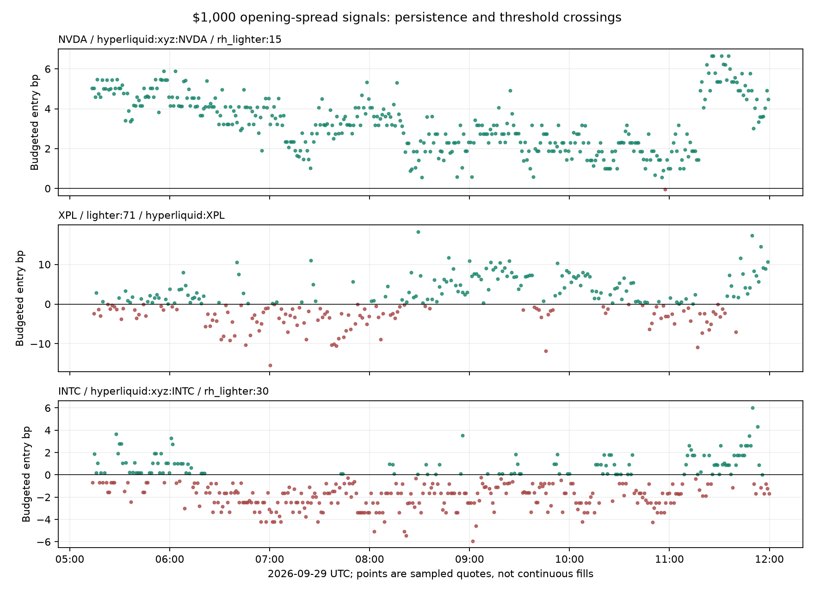

# Overnight monitor audit: tally, persistence, and fee tiers

Frozen at **2026-09-29 12:00 UTC**. Window: **05:13:16–11:59:49 UTC**, 6.78 hours, 84,240 $1,000 directional observations across 68 assets / 254 directed routes. Some listings changed during the run. The SQLite snapshot was read consistently without stopping or modifying the running collector. No observations had yet expired or hit the row cap, so the complete cumulative tally can be reconciled.

## 1. What the roughly $300 actually represents

The monitor is a **signal counter, not a paper-trading simulator with positions and exits**. Its UI's dollar tally made that distinction too easy to miss. It adds the first positive opening edge each time a route becomes eligible again; it does not close a position, realize profit, or manage a fixed capital pool.

| Component | Reconstructed total |
|---|---:|
| Opening spreads after the two opening fees | **$330.85** |
| Estimated two closing-fee reserve | −$70.23 |
| Configured 5 bp other-cost buffer | −$215.92 |
| Remaining sum of entry signals | **$44.70** |
| Counted positive episodes | **432** |
| Median remaining value per episode | **$0.0593** |

All fee and budget arithmetic reconciles exactly to the saved state. This does not establish trade profitability. A short perpetual does not pay its entire notional into your account at entry. Capturing a basis requires a later exit or favorable funding; the monitor's reserve includes estimated closing **fees**, but not the actual price gap paid to close.

**421 of 432 episodes** were a threshold crossing back above zero. **291 episodes** contributed less than ten cents after reserves. This is why a steadily rising tally can coexist with weak or negative trading economics. The naive sum of every positive poll would be even larger—$580.00—and was not used for the displayed episode tally.

Cumulative $1,000 allocations across 432 episodes are $432,000 of matched notional, with another offsetting leg. This is not a return on a single $1,000 deposit or a statement that $432,000 of cash capital is necessary: the program has no portfolio allocation, position overlap, or margin ledger.

Largest contributions to the opening-edge sum were XPL ($43.16), INTC ($31.02), HBAR ($28.39), MSFT ($28.18), and silver ($24.20). See [all contributions](asset_contributions.csv).

## 2. What happens when an exit is included?

The saved observations contain size-aware VWAPs in both directions, but not full historical orderbooks. I matched each eligible entry to the opposite route approximately 5, 15, 30, or 60 minutes later, applied the original quantity, and charged all four trading fees.

**This is a diagnostic proxy, not an exact historical fill replay.** Opposite-direction VWAPs were measured at a nearby quantity; only differences within 1% were accepted. A larger reference quantity is conservative for the original quantity on a sorted book, while a smaller one can be optimistic. Five-minute comparisons had a 95th-percentile absolute quantity difference of 0.527%. Exits had to appear within three minutes after the target horizon. Scenarios overlap and must not be summed into portfolio returns.

The table below excludes scenarios crossing a UTC funding hour. It still omits execution failures, actual stablecoin conversions and exact funding/ledger reconstruction.

| Horizon | Eligible scenarios | Positive after four fees | Median proxy result / $1k | Positive also after the 5 bp buffer |
|---|---:|---:|---:|---:|
| Immediate reverse quote | 432 | 0 | −$0.546 | 0 |
| 5 minutes | 395 | 8 (2.0%) | **−$0.521** | 1 |
| 15 minutes | 325 | 8 (2.5%) | **−$0.484** | 1 |
| 30 minutes | 206 | 8 (3.9%) | **−$0.438** | 1 |

The entry-gap sum is therefore not supported by the subsequent-exit evidence. Most premiums persisted, or bid/ask spreads and closing costs absorbed the apparent opening edge. [Scenario details](unwind_diagnostics.csv), [summary](unwind_summary.csv).

## 3. How long did a positive signal last?

“Positive” here means after both opening fees, the closing-fee reserve, and the 5 bp buffer under the **original Standard fee settings**. A run ends at the next observed nonpositive value or a data gap over ten minutes.

Across 432 episodes, **189 (43.75%) appeared in just one sample**. The median first-to-last positive observation span was approximately **60 seconds**. A one-sample episode has an observed span of zero; that means its lifetime is unresolved, not that it existed for zero seconds.

| Directed route | Episodes | Single-sample episodes | Typical poll gap | Median first-to-last positive span | Longest observed span |
|---|---:|---:|---:|---:|---:|
| HL → RH Lighter NVDA | 2 | 0 | 60 s | 202 min | **343 min** |
| HL → RH Lighter META | 18 | 6 | 60 s | 180 s | 103 min |
| HL → RH Lighter GOOGL | 21 | 6 | 60 s | 240 s | 132 min |
| HL → RH Lighter silver | 36 | 12 | 60 s | 90 s | 152 min |
| HL → RH Lighter MSFT | 43 | 12 | 60 s | 60 s | 34 min |
| HL → Core Samsung | 31 | 5 | 83 s | 244 s | 26.6 min |
| Core → HL XPL | 37 | 18 | 83 s | 80 s | 53.1 min |

Some long runs are left/right censored by the observation window. NVDA's two runs include a signal already positive at startup and a later run still positive at the snapshot. The 202-minute median is merely the midpoint of two observed spans, not an estimated population lifetime.



### What latency target can we defend?

**No precise subsecond execution deadline can be inferred from this run.** A pair was sampled approximately every 60 seconds on RH or 83 seconds on Core. Prices can cross the threshold, recover, change depth, or become unfillable between those observations. Neither a 60-second observed span nor a five-hour persistent premium proves that a specific quoted fill would remain available.

The persistence file records the preceding nonpositive quote and following nonpositive quote. Their interval is an outer event bracket only under a single-contiguous-episode interpretation; unseen crossings remain possible. We do not call the first-to-last span a guaranteed lifetime or a fill deadline.

Receipt pairing was reasonably close: 95th-percentile skew **545 ms**, and HL engine age **819 ms**. That is useful quality evidence but not an execution benchmark. The Lighter response lacks an engine timestamp. Stale/mismatched observations were rejected by the collector; residual Lighter staleness cannot be excluded.

Lighter's fee and speed tradeoff matters: Standard has a documented 300 ms taker delay; Core Premium base is 140 ms, while RH Premium base is 200 ms and varies by volume. These are venue-imposed delays, not complete end-to-end latency. Faster Premium accounts also change which signals survive fees. [Core account types](https://apidocs.lighter.xyz/docs/account-types), [archived RH account types](../../data/raw/comparators/rh_lighter/20260929T040726Z/sources/account-types.md).

For the next timing experiment, use synchronized streaming books on selected **fee-viable** routes, preserve exact executable quantities, and test whether the edge survives quote age + network + venue processing + hedge delay. Include actual exits and funding. Do not add a high-rate REST collector on top of the current one; it already uses most of the public Lighter request budget.

See [per-route persistence](persistence_routes.csv) and [all episode brackets](persistence_episodes.csv).

## 4. Which fee tiers did the run assume?

The run used a **mixed baseline**, not the uniformly cheapest or most expensive combination:

| Venue | Run assumption | Interpretation |
|---|---|---|
| Robinhood Lighter | Standard, **0 bp** | Cheapest monetary fee; 300 ms taker delay. Premium base is 3.5 bp, with volume discounts. |
| Lighter Core | Standard, **0 bp** | Cheapest monetary fee; 300 ms taker delay. Premium base is 2.8 bp, with staking discounts. |
| Hyperliquid native | **4.5 bp** | Tier 0, no volume/staking/referral discount. This is the highest ordinary base taker tier in the published schedule. |
| Hyperliquid xyz | Base fee × current per-market modifiers | Most sampled equities/silver used **0.9 bp**; these reductions are market settings, not an assumed VIP account. |
| Aster | Flat **4 bp** | General crypto base fee; the run failed to distinguish current asset-specific schedules. Correction below. |

[HL fee tiers](https://hyperliquid.gitbook.io/hyperliquid-docs/trading/fees), [Core fee tiers](https://docs.lighter.xyz/trading/trading-fees), [RH account tiers](https://apidocs.rh.lighter.xyz/docs/account-types).

Holding the original Aster setting and HL Tier 0 fixed, then re-detecting episodes under each Lighter fee tier:

| Lighter tier | Positive episodes | Single-sample episodes | Sum after reserves | RH positive episodes |
|---|---:|---:|---:|---:|
| Standard: 0 bp | 432 | 189 | **$44.70** | 244 |
| Plus: 0.5 bp | 354 | 185 | **$36.79** | 214 |
| Premium: RH 3.5 / Core 2.8 bp | 35 | 19 | **$10.27** | **0** |

Changing fees changes the threshold and episode boundaries, so episode counts are not a simple subset of the baseline entries. These remain sums of signals, not completed trades. The Premium survivors are on Core; their median observed span is zero (most were isolated samples). The original positive tally contained no Aster routes.

[Full fee sensitivity matrix](fee_scenarios.csv) includes all seven HL volume tiers and an explicitly hypothetical highest-volume plus Diamond staking scenario. Qualification requires the stated volume/stake; those discounts should not be assumed for a new account.

### Aster fee correction

The current official schedule specifies **1.25 bp for RWA**, **4 bp general crypto base**, and **10 bp for listed Group B crypto base**. The RWA rate is effective September 7, 2026. The old flat rate overcharged RWA in the model and could undercharge Group B. All 432 originally counted episodes were on Lighter, so this mistake **did not inflate the reported $330.85**. [Aster fees](https://docs.asterdex.com/trading/perpetuals/fees-and-specs/fees), [VIP rules](https://docs.asterdex.com/program-and-rewards/vip-program).

Applying the corrected Aster classification to the saved prices adds 74 Standard-policy Aster episodes and about **$4.27** of budgeted entry-edge sum, taking that scenario from $44.70 to $48.97. Their exits have not been evaluated in the 432-entry diagnostic above. The Aster documentation has conflicting category references for SKHYNIX; the updated code conservatively uses the larger Group B fee when a symbol is explicitly listed there. Group membership must be rechecked when schedules change. [Corrected scenarios](corrected_aster_fee_scenarios.csv).

## 5. Changes and reproduction

- Changed the TUI wording to **entry-edge sum** and **“Closed-trade profit: NOT SIMULATED.”**
- Corrected Aster's fee classification, with configurable general/RWA/Group B rates.
- Fee model version is now 3. A fresh output directory is required so historical records computed using different fees are not mixed.
- The existing running process and its database were left intact. A running Python process does not load these edits automatically. Apply them when you next stop/restart the collector, e.g. `--out data/monitor-v3`; stop the old collector before launching another against the same endpoints.
- Added a reproducible audit script and a compressed public snapshot. The snapshot is about 12 MB and is a one-time audit artifact, not another continuous logger.

Reproduce this exact audit:

```bash
MPLCONFIGDIR=/tmp/rhhype-mpl-cache .venv/bin/python scripts/audit_monitor.py \
  --snapshot data/evidence/monitor-audit-20260929T115958Z \
  --out reports/monitor-audit
```

The baseline audit supports Standard Lighter, HL 4.5 bp base, and enabled exit-fee reserves. Complete reconciliation assumes no earlier observations have expired; later bounded windows may not reconstruct all-time counters. Fee scenarios are counterfactual classifications of observed prices, not a forecast of prices under different account behavior.
